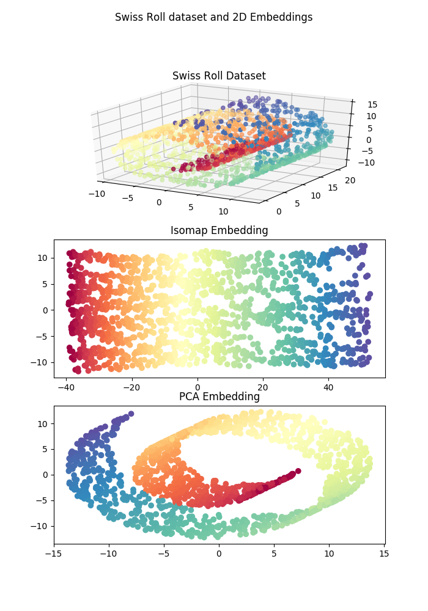
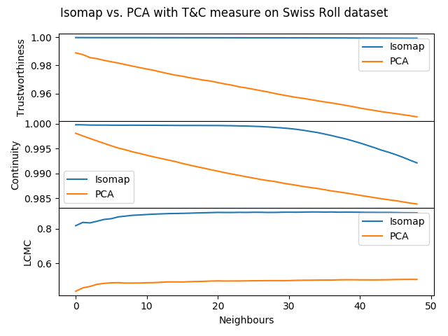

.. coranking documentation master file, created by
   sphinx-quickstart on Sat Jul 14 11:57:13 2018.
   You can adapt this file completely to your liking, but it should at least
   contain the root `toctree` directive.

Welcome to coranking's documentation!
=====================================

`coranking` is a tiny library for calculating the coranking matrix and
associated metrics. This can be used to assess the quality of a lower
dimensional embedding of a higher dimensional space. The definition of the
coranking matrix and the derivation of each of the metrics from the coranking
matrix can be found in this paper:

    Lee, John A., and Michel Verleysen. "Quality assessment of dimensionality
    reduction: Rank-based criteria." Neurocomputing 72.7 (2009): 1431-1443.

API Reference
=============

.. toctree::
   :maxdepth: 3

   source/modules

   
Usage Examples
==============

First lets generate some data and then produce some embeddings in a lower
dimensional space. In the example, the swiss roll dataset is embeded in 2D
using two dimensionality reduction algorithms: Isomap and PCA.

.. code-block:: python

    from sklearn import manifold, datasets
    from sklearn.decomposition.pca import PCA

    X, color = datasets.samples_generator.make_swiss_roll(n_samples=1500)

    # Generate Isomap embedding
    isomap = manifold.Isomap(n_neighbors=12, n_components=2)
    isomap_embedding = isomap.fit_transform(X)

    # Generate PCA embedding
    pca_embedding = PCA(2).fit_transform(X) 

This produces a dataset and projections that look roughly like th following:

Using the coranking library various metrics quantifying the quality of the
lower dimensional embedding can be computed. In the following code the
trustworthiness, continuity, and LCMC metrics are computed for each of teh
Isomap and PCA ebeddings of the data for the first 50 neighbours.

.. code-block:: python

    import coranking
    from coranking.metrics import trustworthiness, continuity, LCMC

    Q = coranking.coranking_matrix(X, isomap_embedding)

    trust_isomap = trustworthiness(Q, min_k=1, max_k=50)
    cont_isomap = continuity(Q, min_k=1, max_k=50)
    lcmc_isomap = LCMC(Q, min_k=1, max_k=50)

    Q = coranking.coranking_matrix(X, pca_embedding)

    trust_pca = trustworthiness(Q, min_k=1, max_k=50)
    cont_pca = continuity(Q, min_k=1, max_k=50)
    lcmc_pca = LCMC(Q, min_k=1, max_k=50)

Plotting the results of the metrics shows that Isomap clearly produces a higher
quality embedding compared to PCA, reflected in the two dimensional plot in the
figure above.

.. Indices and tables
.. ==================

.. * :ref:`genindex`
.. * :ref:`modindex`
.. * :ref:`search`
